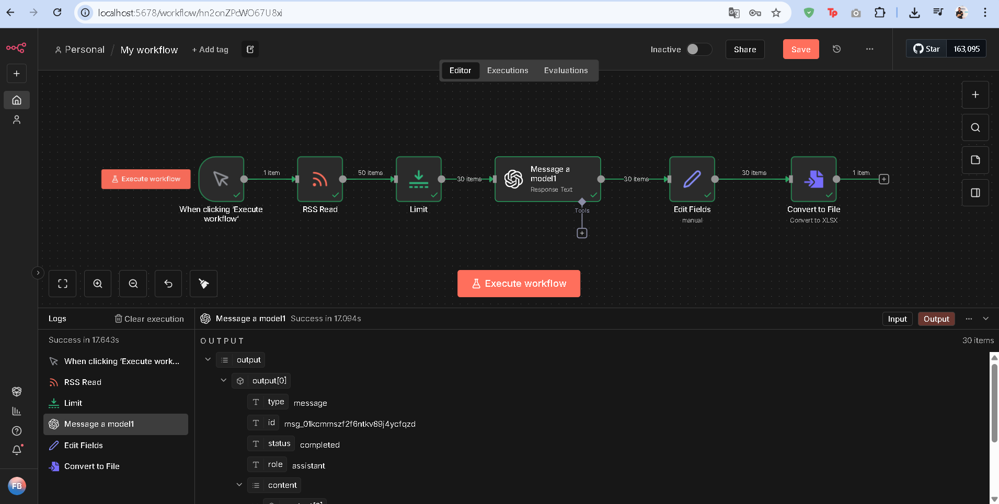

# 🤖 AI-Powered News Sentiment Pipeline



## 🚀 Overview
This project demonstrates a fully automated **ETL (Extract, Transform, Load)** pipeline designed to analyze global technology news in real-time.

Built with **n8n** running on **Docker**, this agent acts as a decision support system by fetching raw RSS data, processing it through **Google Gemini 1.5 Flash (LLM)** for sentiment analysis, and exporting structured data for reporting.

## 🛠️ Tech Stack
* **Orchestration:** [n8n](https://n8n.io/) (Self-hosted via Docker)
* **AI Engine:** Google Gemini 2.5 Flash API
* **Data Source:** RSS Feeds (Dynamic Ingestion)
* **Containerization:** Docker Desktop
* **Output:** Structured .XLSX Reports

## ⚙️ How It Works (The Workflow)
1.  **Ingestion:** The system monitors specific RSS feeds for new content every minute.
2.  **Filtering & Optimization:** Uses a "Split In Batches" logic to manage API rate limits efficiently.
3.  **AI Analysis:** Sends article titles to **Google Gemini**. The LLM evaluates the context and classifies the sentiment as `POSITIVE`, `NEGATIVE`, or `NEUTRAL`.
4.  **Data Structuring:** Merges the raw title with the AI-generated insight.
5.  **Storage:** Automatically generates and saves an Excel report locally.

## 📦 Installation & Usage

### Prerequisites
* Docker installed on your machine.
* A Google AI Studio API Key.

### Steps to Run
1.  Pull the n8n Docker image:
    ```bash
    docker run -it --rm --name n8n -p 5678:5678 -v ~/.n8n:/home/node/.n8n n8nio/n8n
    ```
2.  Open `http://localhost:5678` in your browser.
3.  Import the `workflow.json` file provided in this repository.
4.  Add your Google Gemini API Key in the credentials section.
5.  Execute the workflow!

## 📈 Future Improvements
* Integration with Slack/Discord for instant alerts on "Negative" news.
* Dashboard visualization using Grafana.

---
*Created by [Furkan Bitik / https://www.linkedin.com/in/furkanbitik/]*
